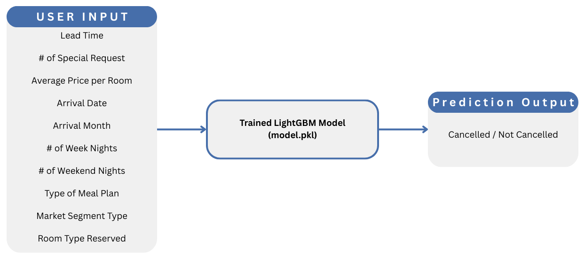
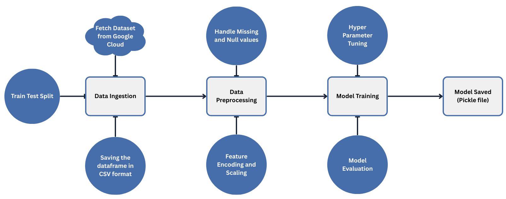
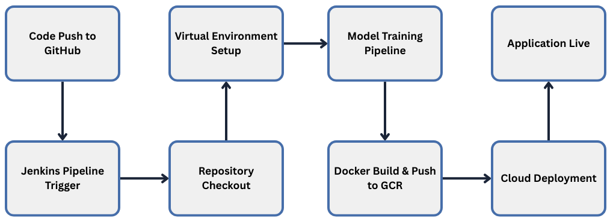

# Hotel Reservation Prediction

## 📑 Index

- [Project Overview](#-project-overview)
- [Business Problem](#-business-problem)
- [Project Architecture](#-project-architecture)
- [Dataset Description](#-dataset-description)
- [Project Structure](#-project-structure)
- [Machine Learning Pipeline](#⚙️-machine-learning-pipeline)
  - [Data Ingestion](#1️⃣-data-ingestion)
  - [Data Preprocessing](#2️⃣-data-preprocessing)
  - [Model Training & Experiment Tracking](#3️⃣-model-training--experiment-tracking)
- [CI/CD & Cloud Deployment](#-cicd--cloud-deployment-pipeline-jenkins--docker--gcp)
  - [Jenkins Container Setup](#-step-1-setup-jenkins-container-docker-in-docker)
  - [Connect Jenkins to GitHub](#-step-2-connect-jenkins-to-github)
  - [Dockerize ML Application](#-step-3-dockerize-the-ml-application)
  - [Install Google Cloud CLI in Jenkins](#-step-4-install-google-cloud-cli-in-jenkins)
  - [Google Cloud Setup](#-step-5-google-cloud-setup)
  - [Jenkins Pipeline](#-step-6-jenkins-pipeline-jenkinsfile)

- [Technology Stack](#-technology-stack)
- [Model Performance & Demo](#-model-performance--application-demo)

## 🏨 Project Overview

The objective of this project is to build a **machine learning system that predicts whether a customer will cancel a hotel reservation or not**. The model analyzes historical booking data and learns patterns that indicate the likelihood of cancellation.

This project is designed as an **end-to-end MLOps pipeline**, covering the full lifecycle of a machine learning system including data ingestion, preprocessing, model training, experiment tracking, containerization, and cloud deployment.

Multiple machine learning models were evaluated during the **Exploratory Data Analysis (EDA)** stage. After experimentation, the **LightGBM Classifier** was selected as the final model due to its strong performance, lightweight architecture, and efficient memory usage compared to other models.

The project also integrates **MLflow** for experiment tracking, allowing monitoring of model parameters, performance metrics (accuracy, precision, recall), and dataset changes.

To simulate a real-world production workflow, the system includes a **CI/CD pipeline using Jenkins and Docker**:

- The project repository is connected to **GitHub**, allowing Jenkins to automatically detect code updates.
- The application is containerized using **Docker**.
- Jenkins builds the Docker image and pushes it to **Google Container Registry (GCR)**.
- The containerized application is then deployed to **Google Cloud Run**.

Additionally, the dataset is stored in **Google Cloud Storage**, enabling centralized data management for the machine learning pipeline.

This project demonstrates a complete **machine learning deployment workflow using modern MLOps practices**, combining model development, experiment tracking, automated deployment, and cloud infrastructure.

---

## 💼 Business Problem

Hotel reservation cancellations can lead to significant **revenue loss and operational inefficiencies**. When customers cancel bookings at the last minute, hotels often struggle to fill those rooms, resulting in lost income. By predicting whether a reservation is likely to be cancelled, hotels can take proactive actions to reduce financial loss and optimize their operations.

This prediction system supports several important business use cases:

### Revenue Management

Hotels frequently face losses due to last-minute cancellations. By predicting the likelihood of cancellation, hotels can implement **overbooking strategies**, where multiple reservations may be accepted for the same room. If one guest cancels, the room can still be occupied, ensuring minimal revenue loss.

### Targeted Marketing

If a booking is predicted to have a high probability of cancellation, hotels can attempt to retain the customer by offering incentives such as:

- complimentary meals
- swimming pool access
- room upgrades
- special promotional discounts

These targeted offers can encourage customers to keep their reservations.

### Fraud Detection

Repeated cancellations or unusual booking patterns may indicate fraudulent behavior. Predictive analysis can help identify suspicious patterns and support hotel management in detecting potential misuse of reservation systems.

## 🏗 Project Architecture

<h3 align="center">🔄 Application Workflow</h2>

<p align="center">
  
</p>

<h3 align="center">🧠 ML Model Training Pipeline</h2>

<p align="center">
  
</p>
<h3 align="center">🚀 Jenkins CI/CD Pipeline</h2>

<p align="center">
  
</p>

## 📊 Dataset Description

📥 **Dataset:** [Hotel Reservation Dataset](https://www.kaggle.com/datasets/ahsan81/hotel-reservations-classification-dataset)

This project uses a **Hotel Reservation Dataset** to analyze booking patterns and predict whether a reservation will be **Canceled** or **Not Canceled**.

---

### Dataset Overview

- **Total Records:** 25,392
- **Total Features:** 18
- **Duplicate Records:** 6,419
- **Target Variable:** `booking_status`

The dataset contains both **categorical** and **numerical** features representing reservation details, guest information, and booking behavior.

---

### Sample Records from Dataset

<div>
<table border="1" class="dataframe">
<thead>
<tr style="text-align: right;">
<th></th>
<th>Booking_ID</th>
<th>no_of_adults</th>
<th>no_of_children</th>
<th>no_of_weekend_nights</th>
<th>no_of_week_nights</th>
<th>type_of_meal_plan</th>
<th>required_car_parking_space</th>
<th>room_type_reserved</th>
<th>lead_time</th>
<th>arrival_year</th>
<th>arrival_month</th>
<th>arrival_date</th>
<th>market_segment_type</th>
<th>repeated_guest</th>
<th>no_of_previous_cancellations</th>
<th>no_of_previous_bookings_not_canceled</th>
<th>avg_price_per_room</th>
<th>no_of_special_requests</th>
<th>booking_status</th>
</tr>
</thead>
<tbody>
<tr>
<th>0</th>
<td>INN00001</td>
<td>2</td>
<td>0</td>
<td>1</td>
<td>2</td>
<td>Meal Plan 1</td>
<td>0</td>
<td>Room_Type 1</td>
<td>224</td>
<td>2017</td>
<td>10</td>
<td>2</td>
<td>Offline</td>
<td>0</td>
<td>0</td>
<td>0</td>
<td>65</td>
<td>0</td>
<td>Not_Canceled</td>
</tr>
<tr>
<th>1</th>
<td>INN00002</td>
<td>2</td>
<td>0</td>
<td>2</td>
<td>3</td>
<td>Not Selected</td>
<td>0</td>
<td>Room_Type 1</td>
<td>5</td>
<td>2018</td>
<td>11</td>
<td>6</td>
<td>Online</td>
<td>0</td>
<td>0</td>
<td>0</td>
<td>106.68</td>
<td>1</td>
<td>Not_Canceled</td>
</tr>
</tbody>
</table>
</div>

---

### Dataset Features

#### Categorical Features

- `type_of_meal_plan`
- `required_car_parking_space`
- `room_type_reserved`
- `market_segment_type`
- `repeated_guest`
- `booking_status` _(Target Variable)_

#### Numerical Features

- `no_of_adults`
- `no_of_children`
- `no_of_weekend_nights`
- `no_of_week_nights`
- `lead_time`
- `arrival_year`
- `arrival_month`
- `arrival_date`
- `no_of_previous_cancellations`
- `no_of_previous_bookings_not_canceled`
- `avg_price_per_room`
- `no_of_special_requests`

---

### Target Variable Distribution

| Booking Status | Count  |
| -------------- | ------ |
| Not_Canceled   | 13,493 |
| Canceled       | 5,480  |

⚠️ The dataset is **imbalanced**, with significantly more **Not_Canceled** bookings than **Canceled** bookings.

---

### Key Observations from Exploratory Data Analysis

#### Lead Time vs Booking Status

- When **lead time is around 80 days**, bookings are mostly **not canceled**.
- When **lead time exceeds 100–200 days**, the probability of **cancellation increases significantly**.

#### Meal Plan vs Cancellation

- Guests choosing **Meal Plan 2** are **more likely to cancel** their reservations.

#### Parking Space vs Cancellation

- Guests who request **car parking** are **very unlikely to cancel** their bookings.

#### Room Type vs Cancellation

- **Room Type 6 (Deluxe rooms)** shows a **higher cancellation rate**, which could potentially lead to revenue loss.

#### Market Segment vs Cancellation

- **Corporate bookings rarely cancel**.
- **Online bookings have roughly a 50% probability of cancellation**.

#### Repeated Guests

- **Returning guests are significantly less likely to cancel bookings.**

---

### Feature Importance Analysis

| Rank | Feature                | Importance |
| ---- | ---------------------- | ---------- |
| 1    | lead_time              | 0.262      |
| 2    | no_of_special_requests | 0.182      |
| 3    | avg_price_per_room     | 0.148      |
| 4    | arrival_month          | 0.087      |
| 5    | arrival_date           | 0.083      |
| 6    | market_segment_type    | 0.053      |
| 7    | no_of_week_nights      | 0.045      |
| 8    | no_of_weekend_nights   | 0.028      |
| 9    | type_of_meal_plan      | 0.021      |
| 10   | room_type_reserved     | 0.019      |

---

### Selected Features for Model Training

Instead of using all **17 input features**, the **top 10 most important features** were selected.

**Selected Features**

- `lead_time`
- `no_of_special_requests`
- `avg_price_per_room`
- `arrival_month`
- `arrival_date`
- `market_segment_type`
- `no_of_week_nights`
- `no_of_weekend_nights`
- `type_of_meal_plan`
- `room_type_reserved`

**Target Variable**

- `booking_status`

## 📁 Project Structure

The project follows a **modular machine learning pipeline architecture** to ensure maintainability, scalability, and reproducibility.

```
hotel_reservation/
│
├── application.py
├── requirements.txt
├── setup.py
├── Dockerfile
├── Jenkinsfile
├── mlflow.db
│
├── artifacts/
│   ├── models/
│   │   └── lgbm_model.pkl
│   ├── processed/
│   │   ├── processed_train.csv
│   │   └── processed_test.csv
│   └── raw/
│       ├── raw.csv
│       ├── train.csv
│       └── test.csv
│
├── config/
│   ├── __init__.py
│   ├── config.yaml
│   ├── model_params.py
│   └── paths_config.py
│
├── pipeline/
│   ├── __init__.py
│   └── training_pipeline.py
│
├── src/
│   ├── __init__.py
│   ├── custom_exception.py
│   ├── data_ingestion.py
│   ├── data_preprocessing.py
│   ├── logger.py
│   └── model_training.py
│
├── utils/
│   ├── __init__.py
│   └── common_functions.py
│
├── notebook/
│   ├── notebook.ipynb
│   └── random_forest.pkl
│
├── templates/
│   └── index.html
│
├── static/
│   └── style.css
│
├── logs/
│   └── log_*.log
│
├── mlruns/
│
└── README.md
```

---

### Application Layer

`application.py`

Entry point of the application.
Loads the trained model and provides the interface for making predictions through the web application.

---

### Artifacts

Stores outputs generated during the machine learning pipeline.

`artifacts/models/`
Contains trained machine learning models.

- **lgbm_model.pkl** → Serialized LightGBM model used for predictions.

`artifacts/processed/`
Stores cleaned and transformed datasets.

- `processed_train.csv` → Preprocessed training dataset
- `processed_test.csv` → Preprocessed testing dataset

`artifacts/raw/`
Stores raw datasets before preprocessing.

- `raw.csv` → Original dataset
- `train.csv` → Training dataset split
- `test.csv` → Testing dataset split

---

### Configuration

`config/`
Contains configuration files for managing parameters and paths.

- **config.yaml** → Stores project configuration and pipeline parameters
- **model_params.py** → Defines model hyperparameters
- **paths_config.py** → Stores all directory and file paths used in the project

---

### Pipeline

`pipeline/`

Contains the pipeline orchestration logic.

- **training_pipeline.py** → Executes the complete ML pipeline including
  - data ingestion
  - preprocessing
  - model training
  - artifact generation

---

### Source Code

`src/`
Contains core machine learning components.

- **custom_exception.py** → Custom exception handling for the project
- **data_ingestion.py** → Handles dataset loading and train-test splitting
- **data_preprocessing.py** → Performs feature engineering and preprocessing
- **logger.py** → Logging configuration for tracking pipeline execution
- **model_training.py** → Implements model training and evaluation

---

### Utility Functions

`utils/`
Reusable helper functions used across different modules.

- **common_functions.py** → Common utilities for data processing, evaluation, and file handling.

---

### Notebooks

`notebook/`

Used for experimentation and exploratory data analysis.

- **notebook.ipynb** → EDA, visualization, and feature analysis
- **random_forest.pkl** → Experimental model saved during analysis

---

### Web Interface

`templates/`

Contains HTML templates for the web interface.

- **index.html** → Frontend page for model prediction input.

`static/`

Contains static frontend resources.

- **style.css** → CSS styling for the web application.

---

### Logging

`logs/`
Stores runtime logs for debugging and monitoring pipeline execution.

- `log_*.log` → Timestamped log files generated during pipeline runs.

---

### Experiment Tracking

`mlruns/`
Directory created by **MLflow** to store experiment runs, metrics, parameters, and artifacts.

`mlflow.db`
SQLite database used by MLflow to store experiment metadata.

---

### DevOps & Deployment

`Dockerfile`
Defines container configuration for deploying the application.

`Jenkinsfile`
Defines CI/CD pipeline steps for automated build and deployment.

---

### Dependency Management

`requirements.txt`
Lists all Python dependencies required for the project.

`setup.py`
Used to package the project and install it as a Python module.

---

### Documentation

`README.md`

Contains project documentation, setup instructions, and usage guidelines.

## ⚙️ Machine Learning Pipeline

This project implements a **complete ML pipeline** for hotel booking cancellation prediction. The pipeline consists of three main stages: **Data Ingestion**, **Data Preprocessing**, and **Model Training**.

---

### 1️⃣ Data Ingestion

- The dataset is **automatically fetched** from a Google Cloud bucket.
  - This allows us to **keep updating** to the latest and most relevant data.
- After downloading, the dataset is split into **train and test sets** using a **70:30 ratio**.
- The individual datasets are saved in the **`artifacts/raw/`** folder:
  - `train.csv` → Training data
  - `test.csv` → Testing data
  - `raw.csv` → Full raw dataset

---

### 2️⃣ Data Preprocessing

- **Irrelevant columns** such as `Booking_ID` and unnamed index columns are dropped.
- **Duplicates and missing values** are handled.
- **Categorical columns** are label-encoded to convert them into numeric values for ML model training.

#### **Label Mappings:**

| Column                       | Mapping                                                                                                                        |
| ---------------------------- | ------------------------------------------------------------------------------------------------------------------------------ |
| `type_of_meal_plan`          | {'Meal Plan 1': 0, 'Meal Plan 2': 1, 'Meal Plan 3': 2, 'Not Selected': 3}                                                      |
| `required_car_parking_space` | {0: 0, 1: 1}                                                                                                                   |
| `room_type_reserved`         | {'Room_Type 1': 0, 'Room_Type 2': 1, 'Room_Type 3': 2, 'Room_Type 4': 3, 'Room_Type 5': 4, 'Room_Type 6': 5, 'Room_Type 7': 6} |
| `market_segment_type`        | {'Aviation': 0, 'Complementary': 1, 'Corporate': 2, 'Offline': 3, 'Online': 4}                                                 |
| `repeated_guest`             | {0: 0, 1: 1}                                                                                                                   |
| `booking_status`             | {'Canceled': 0, 'Not_Canceled': 1}                                                                                             |

#### **Skewness handling**:

- Columns with skewness above a threshold are log-transformed to reduce skew.

```python
skew_threshold = self.config["data_processing"]["skewness_threshold"]
skewness = df[num_columns].apply(lambda x: x.skew())
for column in skewness[skewness > skew_threshold].index:
    df[column] = np.log1p(df[column])
```

#### **Imbalanced dataset handling**:

- Booking Status distribution:
  - Not_Canceled: 13,493
  - Canceled: 5,480

- To avoid biased predictions, **SMOTE** (Synthetic Minority Oversampling Technique) is applied.

#### **Feature selection**:

- Dataset has 18 columns (17 input + 1 target)
- A **Random Forest** model is used to determine **feature importance**, selecting **top 10 features**:

| Rank | Feature                | Importance |
| ---- | ---------------------- | ---------- |
| 1    | lead_time              | 0.262      |
| 2    | no_of_special_requests | 0.182      |
| 3    | avg_price_per_room     | 0.148      |
| 4    | arrival_month          | 0.087      |
| 5    | arrival_date           | 0.083      |
| 6    | market_segment_type    | 0.053      |
| 7    | no_of_week_nights      | 0.045      |
| 8    | no_of_weekend_nights   | 0.028      |
| 9    | type_of_meal_plan      | 0.021      |
| 10   | room_type_reserved     | 0.019      |

- Preprocessed, balanced, and feature-selected datasets are saved in **`artifacts/processed/`**:
  - `processed_train.csv`
  - `processed_test.csv`

---

### 3️⃣ Model Training & Experiment Tracking

#### **Model Choice**: **LightGBM (LGBM)**

- Reason: Memory-efficient and fast for deployment.
- Compared to Random Forest:
  - RF accuracy: 88.5%, size ~100MB
  - LGBM accuracy: 85%, size 12–20MB → significantly faster in deployment

#### **Hyperparameter tuning** was applied to improve performance by ~1–2%.

```text
Best parameters:
{'boosting_type': 'gbdt', 'learning_rate': 0.129, 'max_depth': 23, 'n_estimators': 314, 'num_leaves': 94}
```

#### **Model Evaluation Metrics**:

| Metric    | Score |
| --------- | ----- |
| Accuracy  | 0.877 |
| Precision | 0.857 |
| Recall    | 0.903 |
| F1 Score  | 0.880 |

#### **Trained model** is serialized and saved as a **pickle file** in **`artifacts/models/`**: `lgbm_model.pkl`

### 📊 MLflow Tracking

The project integrates **MLflow** for experiment tracking and model management.

MLflow helps monitor:

- **Model versions**
- **Dataset changes**
- **Hyperparameters**
- **Model performance metrics**

Using MLflow, each experiment run logs important evaluation metrics such as:

- **Accuracy**
- **Precision**
- **Recall**
- **F1 Score**

MLflow also provides an **interactive UI dashboard** where different experiment runs can be compared, allowing easy tracking of improvements across model versions.

**MLflow Tracking UI Example:**

🎥 Demo Video:

[](https://youtu.be/0oIUOvit4Oo)

---

## 🚀 CI/CD & Cloud Deployment Pipeline (Jenkins + Docker + GCP)

This project implements a **CI/CD pipeline using Jenkins, Docker, and Google Cloud Platform (GCP)** to automate model training, containerization, and deployment.

The pipeline builds and deploys a **Flask-based ML application** that predicts hotel booking cancellations.

The deployment workflow uses the **Docker-in-Docker (DinD)** approach where Jenkins runs inside a Docker container and builds another container for the ML application.

---

### ⚙️ CI/CD Workflow


The automated pipeline executes the following stages:

1. **Jenkins Container Setup**
   - Jenkins runs inside a Docker container.
   - Docker CLI is installed inside the Jenkins container to enable Docker builds.

2. **GitHub Integration**
   - Jenkins connects to the GitHub repository using a **Personal Access Token (PAT)**.
   - Every commit triggers Jenkins to pull the latest code.

3. **Build Pipeline**
   Jenkins performs the following steps:
   - Clone repository
   - Create Python virtual environment
   - Install dependencies
   - Run ML training pipeline
   - Build Docker image
   - Push Docker image to **Google Container Registry (GCR)**
   - Deploy container to **Google Cloud Run**

---

### 🐳 Step 1: Setup Jenkins Container (Docker-in-Docker)

Create a folder:

```
custom_jenkins/
```

Inside it create a **Dockerfile**.

#### Jenkins Dockerfile

```dockerfile
FROM jenkins/jenkins:lts

USER root

RUN apt-get update && \
    apt-get install -y \
    ca-certificates \
    curl \
    gnupg \
    lsb-release && \
    mkdir -p /etc/apt/keyrings && \
    curl -fsSL https://download.docker.com/linux/debian/gpg | \
    gpg --dearmor -o /etc/apt/keyrings/docker.gpg && \
    echo "deb [arch=$(dpkg --print-architecture) signed-by=/etc/apt/keyrings/docker.gpg] \
    https://download.docker.com/linux/debian \
    $(lsb_release -cs) stable" \
    > /etc/apt/sources.list.d/docker.list && \
    apt-get update && \
    apt-get install -y docker-ce-cli

RUN groupadd -f docker && \
    usermod -aG docker jenkins

USER jenkins
```

#### Build Jenkins Image

```bash
docker build -t jenkins-dind .
```

#### Run Jenkins Container

```bash
docker run -d \
--name jenkins-dind \
--privileged \
-p 8080:8080 \
-p 50000:50000 \
-v /var/run/docker.sock:/var/run/docker.sock \
-v jenkins_home:/var/jenkins_home \
jenkins-dind
```

Open Jenkins UI:

```
http://localhost:8080
```

Retrieve the initial admin password:

```bash
docker logs jenkins-dind
```

Install **Suggested Plugins** and create the admin user.

---

### 🔗 Step 2: Connect Jenkins to GitHub

Generate a **GitHub Personal Access Token**.

GitHub →
Settings → Developer Settings → Personal Access Tokens → Classic Token

Required permissions:

- `repo`
- `admin:repo_hook`

Add this token in Jenkins:

```
Manage Jenkins
→ Credentials
→ Global
→ Add Credentials
```

Use:

- **Username** → GitHub username
- **Password** → GitHub Personal Access Token

🎥 Video Tutorial

[](https://youtu.be/P3vWrNEeTh8)

---

### 🐳 Step 3: Dockerize the ML Application

Create the main **Dockerfile** for the ML application.

#### Application Dockerfile

```dockerfile
FROM python:slim

ENV PYTHONDONTWRITEBYTECODE=1
ENV PYTHONUNBUFFERED=1

WORKDIR /app

RUN apt-get update && apt-get install -y --no-install-recommends \
    libgomp1 \
    && apt-get clean \
    && rm -rf /var/lib/apt/lists/*

COPY . .

RUN pip install --no-cache-dir -e .

ENV PORT=8080
EXPOSE 8080

CMD ["python", "application.py"]
```

This container:

- Installs project dependencies
- Packages the ML model
- Runs the **Flask application**
- Exposes the service on **port 8080**

---

### ☁️ Step 4: Install Google Cloud CLI in Jenkins

Enter Jenkins container:

```bash
docker exec -u root -it jenkins-dind bash
```

Install Google Cloud CLI:

```bash
apt-get update
apt-get install -y curl gnupg ca-certificates

mkdir -p /usr/share/keyrings

curl -fsSL https://packages.cloud.google.com/apt/doc/apt-key.gpg \
 | gpg --dearmor -o /usr/share/keyrings/google-cloud.gpg

echo "deb [signed-by=/usr/share/keyrings/google-cloud.gpg] https://packages.cloud.google.com/apt cloud-sdk main" \
 > /etc/apt/sources.list.d/google-cloud-sdk.list

apt-get update
apt-get install -y google-cloud-cli
```

Verify installation:

```bash
gcloud --version
```

---

### ☁️ Step 5: Google Cloud Setup

1. Create a **Google Cloud Project**
2. Create a **Service Account**
3. Assign roles:

- Cloud Run Admin
- Storage Admin
- Artifact Registry Admin

Enable required APIs:

- Cloud Run API
- Artifact Registry API
- Cloud Resource Manager API
- Container Registry API

🎥 Video Tutorial

[](https://www.youtube.com/watch?v=ChbKqzJuj-8)

Download the **Service Account JSON Key**.

Add it in Jenkins:

```
Manage Jenkins
→ Credentials
→ Global
→ Add Credentials
→ Secret File
```

Upload the JSON key.

🎥 Video Tutorial
[](https://youtu.be/_cGM1yeGSDg)

---

### 🔁 Step 6: Jenkins Pipeline (Jenkinsfile)

The Jenkins pipeline automates the full CI/CD workflow.

#### Pipeline Stages

```
Clone Repository
↓
Create Virtual Environment
↓
Run Training Pipeline
↓
Build Docker Image
↓
Push Image to Google Container Registry
↓
Deploy to Google Cloud Run
```

After configuring the pipeline, trigger it in Jenkins by clicking:

##### Build Now

🎥 Video Tutorial for creating new pipeline in jenkins
[](https://youtu.be/F3cqsQqp4pc)

---

### ✅ Deployment Result

Once the pipeline completes successfully:

- The Docker image is stored in **Google Container Registry**
- The container is deployed to **Google Cloud Run**
- The ML prediction service becomes publicly accessible via a **Cloud Run URL**

---

## ⚙️ Technology Stack

- **Programming Language:** Python
- **Machine Learning:** Scikit-learn, XGBoost
- **Backend Framework:** Flask
- **Frontend:** HTML, CSS
- **API Architecture:** REST API
- **Containerization:** Docker
- **CI/CD:** Jenkins
- **Cloud Platform:** Google Cloud
- **Container Registry:** Google Container Registry (GCR)

## 📈 Model Performance & Application Demo

### 📊 Model Performance

Multiple machine learning models were trained and evaluated to predict **hotel booking cancellations**.  
The models were compared using the following classification metrics:

- **Accuracy**
- **Precision**
- **Recall**
- **F1 Score**

During experimentation, several models such as **Random Forest**, **XGBoost**, and **LightGBM** were tested.

Although **Random Forest** produced slightly higher accuracy during experimentation, it required significantly **more memory (~100 MB)** compared to **LightGBM (~12–20 MB)**.

Since the application is designed for **cloud deployment and scalable inference**, **LightGBM** was selected as the final model because it provides:

- High predictive performance
- Faster inference time
- Lower memory consumption
- Better efficiency for deployment environments

### ✅ Final Model Performance (LightGBM)

| Metric    | Score  |
| --------- | ------ |
| Accuracy  | 0.8766 |
| Precision | 0.8574 |
| Recall    | 0.9034 |
| F1 Score  | 0.8798 |

The final **LightGBM classifier** achieves strong performance in identifying both **canceled** and **non-canceled bookings**, making it suitable for real-world deployment scenarios.

---

### 🎥 Application Demo

The video below demonstrates the **Flask-based web application** where users can enter booking details and receive a prediction indicating whether the booking is likely to be **canceled or not canceled**.

▶️ Watch the demo video here:

[](https://youtu.be/Cgfm7tCN5yc)

The demonstration includes:

- Launching the Flask web application
- Entering booking details through the user interface
- Sending the input to the trained ML model
- Displaying the predicted **booking status (Canceled / Not Canceled)**
- End-to-end **ML inference pipeline execution**
